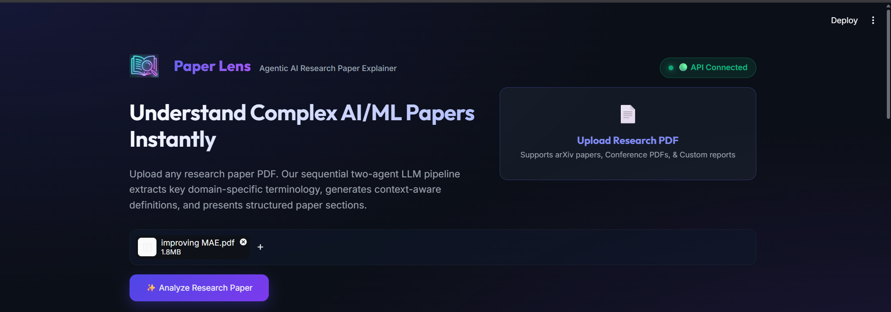
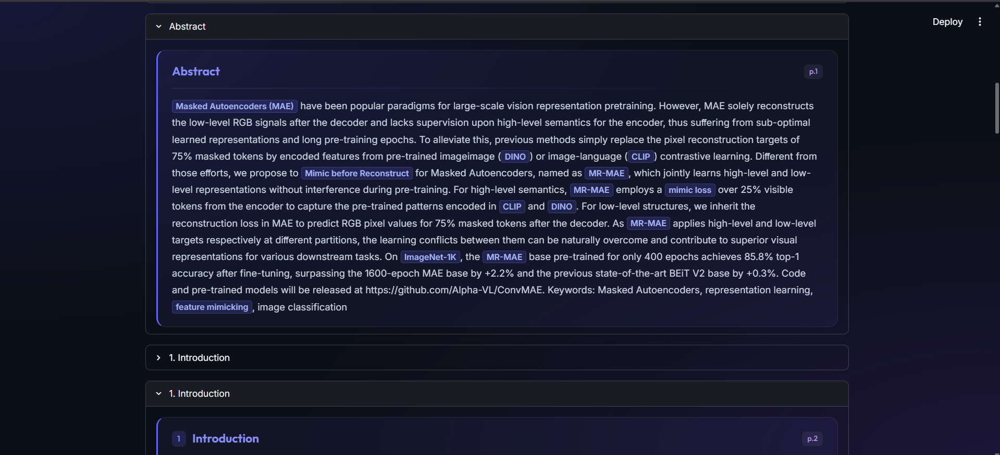
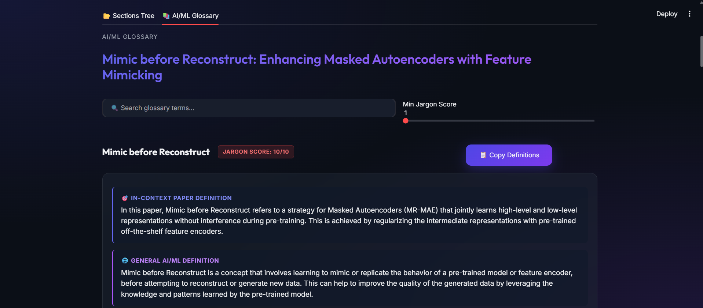

[](https://repoclip.io/v/8819720e-4aa6-4673-809e-e46041eeddfe)

# Paper Lens

Paper Lens is an agentic research paper analysis tool that takes any AI/ML research paper PDF, parses it into a structured section hierarchy, and then runs a sequential two-agent LLM pipeline — the first agent scans the full paper text and extracts every domain-specific AI/ML term that matters to *this specific paper's contribution* (not generic ML words like "training" or "loss"), assigning each term a jargon score from 1–10 to indicate how paper-specific it is; the second agent then takes every extracted term and produces two definitions for it: a *context definition* that explains what the term means within the scope and framing of this particular paper, and a *general definition* that explains what it means broadly in the AI/ML field — the entire glossary is persisted to a SQLite database alongside the parsed sections, and monitoring snapshots of each agent's output are saved to disk so you can inspect exactly what the pipeline produced at each stage.

## Screenshots

**Intro — Upload & Hero**


**Sections Tree — Structured Paper Hierarchy**


**AI/ML Glossary — Term Definitions & Jargon Scores**


---

## CLI — Data Flow

### Setup

```bash
# 1. Clone and install
git clone <repo>
cd paper-lens

# 2. Install dependencies (project uses uv)
uv sync

# 3. Add your Groq API key
cp .env.example .env
# Edit .env and set: GROQ_API_KEY=your_key_here
```

### Run

```bash
python src/main.py "src/data/attention_is_all_you_need.pdf"
```

### What happens step by step

```
[1/3] Parsing 'src/data/attention_is_all_you_need.pdf'...
      Parsed 12 top-level sections -> src/outputs/attention_is_all_you_need.json
```

The PDF is extracted page by page using `pypdf`. Text is split into lines and
matched against section heading patterns (numbered sections like `1. Introduction`,
multi-level like `3.2 Attention Head`, and unnumbered standard headings like
`Abstract`, `References`). The result is a nested JSON hierarchy:

```json
[
  { "title": "Preamble",   "content": "Attention Is All You Need", "subsections": [] },
  { "title": "Abstract",   "content": "The dominant sequence ...",  "subsections": [] },
  { "title": "Introduction","number": "1", "page_number": 1,
    "subsections": [
      { "title": "Background", "number": "1.1", "content": "...", "subsections": [] }
    ]
  }
]
```

Saved to `src/outputs/attention_is_all_you_need.json`.

---

```
[2/3] Running agentic pipeline...
[pipeline] Running TermExtractorAgent for 'attention_is_all_you_need'...
[pipeline] Monitoring output saved -> src/outputs/extracted_terms_attention_is_all_you_need.json
```

**Agent 1 — Term Extractor** receives the full flattened paper text in a single
Groq LLM call. It is instructed to include only paper-specific terminology and
assign a `jargon_score` (1–10):

```json
[
  {
    "term": "Multi-Head Attention",
    "jargon_score": 10,
    "occurrences": [
      "Multi-head attention allows the model to jointly attend to information from different representation subspaces at different positions.",
      "We employ h = 8 parallel attention heads."
    ]
  },
  {
    "term": "Scaled Dot-Product Attention",
    "jargon_score": 10,
    "occurrences": [
      "We call our particular attention 'Scaled Dot-Product Attention'. The input consists of queries and keys of dimension dk."
    ]
  },
  {
    "term": "Positional Encoding",
    "jargon_score": 9,
    "occurrences": [
      "Since our model contains no recurrence and no convolution, we inject positional encodings into the input embeddings."
    ]
  },
  {
    "term": "BLEU Score",
    "jargon_score": 5,
    "occurrences": [
      "On the WMT 2014 English-to-German translation task, the big transformer model outperforms the best previously reported models by more than 2.0 BLEU."
    ]
  }
]
```

Saved to `src/outputs/extracted_terms_attention_is_all_you_need.json`.

---

```
[pipeline] Running TermExplainerAgent for 'attention_is_all_you_need' (4 terms)...
[pipeline] Monitoring output saved -> src/outputs/explained_terms_attention_is_all_you_need.json
      Done - 4 terms extracted and explained.
      Paper: Attention Is All You Need
```

**Agent 2 — Term Explainer** makes one Groq LLM call per term, injecting the
paper title and the occurrence sentences as grounding context. Each call returns:

```json
[
  {
    "term": "Multi-Head Attention",
    "jargon_score": 10,
    "context_definition": "In this paper, Multi-Head Attention is the core building block of the Transformer architecture. Rather than performing a single attention function over the full model dimension, the authors project queries, keys, and values h times (h=8) using different learned linear projections, run attention in parallel on each projection, concatenate the outputs, and project again. This lets the model simultaneously attend to information from different representation subspaces at different positions — something a single attention head cannot do.",
    "general_definition": "Multi-Head Attention is a mechanism in neural networks where the standard dot-product attention operation is repeated in parallel h times with independently learned weight matrices. Each 'head' can learn to attend to different aspects of the input (e.g., syntactic vs. semantic relationships). The outputs of all heads are concatenated and linearly projected. It is a foundational component of the Transformer architecture and appears in virtually all modern large language models.",
    "occurrences": [
      "Multi-head attention allows the model to jointly attend to information from different representation subspaces at different positions.",
      "We employ h = 8 parallel attention heads."
    ]
  }
]
```

Saved to `src/outputs/explained_terms_attention_is_all_you_need.json`.

---

```
[3/3] Saving to database 'src/data/attention_is_all_you_need.db'...
      Database saved -> src/data/attention_is_all_you_need.db
      extracted_terms stored on 18 section rows

+--------------------------------------------------+
|  Paper Lens - Complete                          |
+--------------------------------------------------+
|  PDF parsed      : src/outputs/attention_is_all_you_need.json
|  Terms extracted : 4
|  Agent 1 output  : src/outputs/extracted_terms_attention_is_all_you_need.json
|  Agent 2 output  : src/outputs/explained_terms_attention_is_all_you_need.json
|  Database        : src/data/attention_is_all_you_need.db
+--------------------------------------------------+
```

Every section row in `sections` (SQLite) now has an `extracted_terms` JSON
column containing the full glossary. The DB can be queried independently of
the output files.

### Idempotency

Running the same PDF twice does nothing:

```
Already processed: 'attention_is_all_you_need'
  Found: src/outputs/explained_terms_attention_is_all_you_need.json
  Use --force to re-run and overwrite existing outputs.
```

Force a re-run with:

```bash
python src/main.py "src/data/attention_is_all_you_need.pdf" --force
```

### Options

```
usage: main.py [-h] [--out-dir OUT_DIR] [--db DB] [--force] pdf

positional arguments:
  pdf              Path to the PDF file to process

options:
  --out-dir        Directory for JSON outputs (default: src/outputs)
  --db             Directory for the SQLite database (default: src/data)
  --force          Re-run even if outputs already exist
```

---

## API Endpoints

Start the server from the project root:

```bash
uvicorn src.api.app:app --reload
```

Interactive docs available at **http://127.0.0.1:8000/docs**

---

### `POST /api/parse-pdf`

Upload a PDF and receive its parsed section hierarchy as JSON. Does **not** run
the agent pipeline — parsing only.

**Request:** `multipart/form-data` with a `file` field containing the PDF.

```bash
curl -X POST http://localhost:8000/api/parse-pdf \
  -F "file=@attention_is_all_you_need.pdf"
```

**Response:**
```json
{
  "filename": "attention_is_all_you_need.pdf",
  "data": [
    { "title": "Preamble", "number": null, "page_number": 1, "content": "Attention Is All You Need", "subsections": [] },
    { "title": "Abstract", "number": null, "page_number": 1, "content": "The dominant sequence...", "subsections": [] },
    { "title": "Introduction", "number": "1", "page_number": 1, "content": "...", "subsections": [...] }
  ]
}
```

---

### `POST /api/analyze`

Feed the parsed section JSON from `/api/parse-pdf` directly into the agent
pipeline. Use this when you want to separate parsing from analysis, or when
you already have the parsed JSON from disk.

**Request:** JSON body — the `data` array from `/api/parse-pdf`.

```bash
curl -X POST http://localhost:8000/api/analyze \
  -H "Content-Type: application/json" \
  -d @src/outputs/attention_is_all_you_need.json
```

**Response:**
```json
{
  "paper_title": "Attention Is All You Need",
  "term_count": 4,
  "glossary": [
    {
      "term": "Multi-Head Attention",
      "jargon_score": 10,
      "context_definition": "In this paper, Multi-Head Attention is ...",
      "general_definition": "Multi-Head Attention is a mechanism in neural networks ...",
      "occurrences": ["Multi-head attention allows the model to jointly attend ..."]
    }
  ]
}
```

---

### `POST /api/parse-and-analyze`

One-shot endpoint. Upload a PDF, get back the parsed sections **and** the full
AI/ML glossary in a single response. Equivalent to calling `/api/parse-pdf`
followed by `/api/analyze`.

**Request:** `multipart/form-data` with a `file` field.

```bash
curl -X POST http://localhost:8000/api/parse-and-analyze \
  -F "file=@attention_is_all_you_need.pdf"
```

**Response:**
```json
{
  "filename": "attention_is_all_you_need.pdf",
  "paper_title": "Attention Is All You Need",
  "term_count": 4,
  "sections": [ ... ],
  "glossary": [ ... ]
}
```

---

## Project Structure

```
src/
├── agents/
│   ├── term_extractor.py   # Agent 1 — extracts AI/ML terms with jargon scores
│   ├── term_explainer.py   # Agent 2 — produces context + general definitions
│   └── pipeline.py         # Orchestrator; saves monitoring outputs to src/outputs/
├── api/
│   ├── app.py              # FastAPI application entry point
│   └── routes.py           # /parse-pdf  /analyze  /parse-and-analyze
├── database/
│   ├── models.py           # Section model with extracted_terms JSON column
│   └── repository.py       # DB helpers: save_document_sections, update_section_terms
├── parser/
│   └── pdf_parser.py       # PDF text extraction and section hierarchy builder
└── main.py                 # CLI entry point — full end-to-end pipeline
```

## Environment

| Variable | Description |
|---|---|
| `GROQ_API_KEY` | Groq API key — required for both agents |

Copy `.env.example` to `.env` and fill it in before running.
